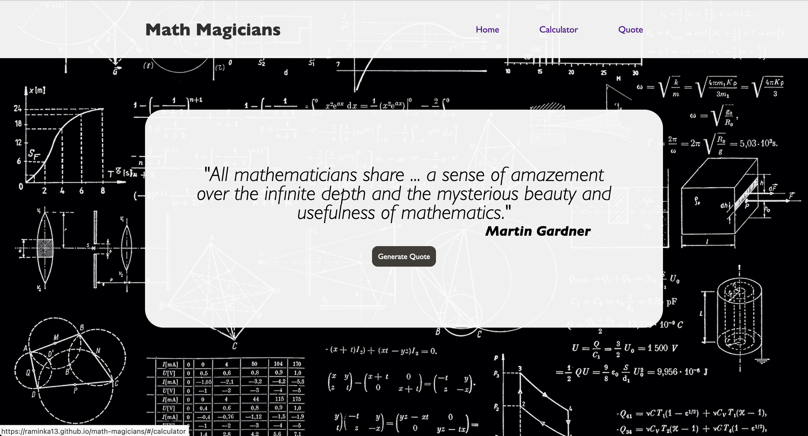

----

    

----
# Math Magicians 🧮
> "Math magicians" is a website for all fans of mathematics. It is a Single Page App (SPA) that allows users to make simple calculations and read a random math-related quote.

## Static Deploy

- [Netlify](https://math-magicians-raminka.netlify.app/)
- [Github Pages](https://raminka13.github.io/math-magicians/)

## Tech ⌘⇧
- **HTML & CSS best practices:** Correct use of tags, elements, properties and syntax.
- **GitHub flow:**  Correct use of Branches for deployment and features development.
- **Webpack:**  Source development for production bundling.
- **Linters Check:** Local and Pull Request Github workflows to check for stylistic errors, bugs and syntax errors in code.
- **React:** Build on `React.js` framework with jsx.

## Clone Repository
- Copy this code on your CLI to clone the repository `$ git clone https://github.com/raminka13/math-magicians.git`
- `cd math-magicians`
- run `npm install` to install all the dependencies.
- run `npm start` to open the app in your localServer.

## Author ✍🏼
👤 **Raul A Ospina** 🧑🏻‍💻
- GitHub: [@raminka13](https://github.com/raminka13)
- Twitter: [@raminka13](https://twitter.com/raminka13)
- LinkedIn: [Raul Ospina](http://linkedin.com/in/raul-ospina-83232614)

## Project Milestones
- **Milestone 0 - project setup (0.5h)** ✅
- **Milestone 1 - basic React components (1h)** ✅
- **Milestone 2 - Calculator logic with events (1h)** 
- **Milestone 3 - Refactor with hooks (1h)** 

## 🤝 Contributing
> Contributions, issues, and feature requests are welcome!
Feel free to check the [issues page](https://github.com/raminka13/math-magicians/issues).

## Show your support 🦾
- Give a ⭐️ if you like this project!

## License 📝 
- This project is [MIT](MIT.md) licensed.

---

   